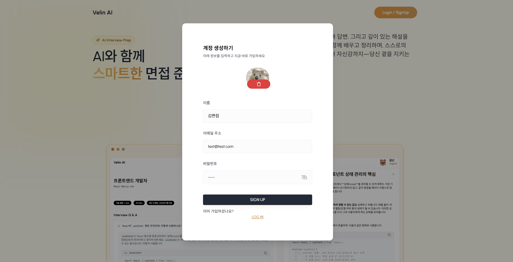
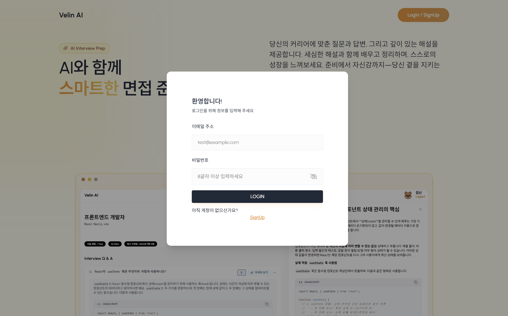

<p align="center">
  <!-- 로고: 필요 시 heroImg.png로 교체 -->
  
</p>

<h3 align="center">Velin AI — InterviewPrep </h3>

## 🔗 Live Demo  
👉 [포트폴리오 사이트 바로가기](https://ai-interview-prep-velin.vercel.app/)

---

## 🚀 프로젝트 소개  
이 프로젝트는 AI 인터뷰 준비를 도와주는 웹 앱입니다.  
React + Vite 기반 프론트엔드 백엔드 (추후 배포할 예정) 구성으로, 인터뷰 예상 질문 생성, 답변 예시 제공 등을 지원합니다.

---

<p align="center">
  <i>현업 관점을 담아, 실무 이해에 유용한 질문과 자료를 제공하는 인터뷰 준비</i>
</p>

<p align="center">
  
  
  
  
  
  
  
  
  
  
  
  
  
  
  
</p>

---


## 🙋‍♀️ 왜 만들었나요

이론 공부만으로는 **현업에서 필요한 관점**을 모두 채우기 어렵습니다.  
저는 “앞으로 같이 일할 동료라면 미리 알고 있어야 할 **질문과 기준, 참고 자료**가 <br />
한 번에 보이면 좋겠다”는 생각으로 이 프로젝트를 만들었습니다.  

- **함께 일할 수 있는가?** 협업·코드 품질·운영 관점의 질문
- **문제를 어떻게 해결할 수 있는가?** 장애/성능/데이터 흐름/보안 시나리오 기반 질문
- **근거가 있는가?** 베스트 프랙티스·레퍼런스 링크·체크리스트 함께 제공
- **바로 적용 가능한가?** 리뷰 포인트/테스트 아이디어/추가 학습 자료 포함

**이렇게 구현했습니다**
- 사용자가 **역할/경력/스택/키워드**를 입력하면  
  `backend/controllers/questionController.js` + `backend/utils/prompts.js`가  
  **실무 시나리오형 질문**과  질문에 대한 참고자료(이론·베스트 프랙티스)를 생성합니다.
- 프론트의 `InterviewPrep.jsx`에서 아코디언 형태로 확인하고,  
  `AIResponsePreview.jsx`로 **근거/예시/요약**을 함께 보여줍니다.

> 함께 일하고 싶은 동료임을 드러내되, 나만의 전문적 판단과 고유한 관점을 잃지 않는 답을 준비하는 것을 목표로 합니다.


## 🧱 기술 스택
- ✅ **Frontend** — React 18 · Vite · TailwindCSS · React Router · Axios  
- ✅ **Backend** — Node.js(Express) · Multer · JWT · Dotenv · CORS  
- ✅ **DB** — MongoDB(Mongoose)  
- ✅ **Dev** — Nodemon · (선택) Docker · ESLint/Prettier
- ✅ **AI** — `Gemini 2.5 Flash` (빠른 응답·저비용·JSON 친화 → 폼 기반 질문 생성에 최적)
                <br/>프롬프트/템플릿: `backend/utils/prompts.js`

---

> 실사용 흐름을 짧은 GIF로 모았습니다. (이미지는 클릭해 확대)


### 🏠 랜딩페이지 
<table align="center">
  <tr>
    <td align="center">
      <b>랜딩 페이지</b><br/>
      
    </td>
  </tr>
</table>

---

### 🔐 회원가입 —  사용자가 기본 정보를 등록합니다.
<table align="center">
  <tr>
    <td align="center">
      <b>회원가입</b><br/>
      
    </td>
  </tr>
</table>

---

### 🔑 로그인 — 저장된 세션과 개인 질문을 불러옵니다.
<table align="center">
  <tr>
    <td align="center">
      <b>로그인</b><br/>
      
    </td>
  </tr>
</table>

---

### ✨📝 질문 생성 폼 — 역할·경력·스택을 입력하면 **실무 관점 질문**과 **참고 자료**가 생성됩니다.
<table align="center">
  <tr>
    <td align="center">
      <b>질문 생성 폼</b><br/>
      
    </td>
  </tr>
</table>


지원자 정보를 간단히 입력하면, 팀이 실제로 확인하는 포인트(협업/품질/운영/보안 등)를 기준으로 <br/>
질문에 대한 간략한 답변과 답변에 대한 자세한 **근거 자료**를 자동 생성합니다.

**입력 항목**
- **희망 직무**: 준비 중인 역할  
  _예: 프론트엔드, 백엔드, UI/UX_
- **총 경력(교육·업무 기간)**: 숫자만 입력  
  _예: 1, 2, 3_
- **주요 준비 항목**: 쉼표(,)로 구분한 기술/키워드/주제  
  _예: React, Next.js, 상태관리, 성능 최적화_
- **비고 / 메모**: 이번 연습의 목표·전략·주의할 점  
  _예: “SEO·렌더링 전략 강조, 코드 예시는 간단히”_


  **구성 파일**
  - Frontend: `frontend/ai-interview/src/pages/InterviewPrep/InterviewPrep.jsx`,  
    `frontend/ai-interview/src/pages/InterviewPrep/components/AIResponsePreview.jsx`
  - Backend: `backend/routes/questionRoutes.js`, `backend/controllers/questionController.js`,  
    `backend/utils/prompts.js`

---

### 📄✅ 생성 결과 확인 (개인 질문 페이지) — 생성된 질문과 참고 자료를 한 화면에서 확인합니다.
<p align="center">
  
</p>

---


### ✨📝 생성 결과 확인 (세부 자료) — 각 질문에서 **핵심 배경·실무 포인트·예시 코드**를 함께 확인할 수 있습니다.
<p align="center">
  
</p>

- 생성된 질문 카드의 **자세히 보기**를 열면 아래를 확인합니다.
  - **질문의 근거**: 면접 의도, 검증 기준, 참고 근거
  - **실무에서 유용한 정보**: 적용 시 주의점, 모범 사례, 체크리스트/레퍼런스
  - **예시 코드 블록**: 바로 실험해볼 수 있는 간단한 코드 예시


---


## ✨ 핵심 기능 (요약)
- 🔐 **인증**: 회원가입/로그인 (JWT) — `backend/controllers/authController.js`, `routes/authRoutes.js`
- ❓ **질문 생성/추천**: 직무·키워드 기반 — `controllers/questionController.js`, `models/Question.js`
- 🗣️ **연습 UI**: 질문 카드/답변 미리보기 — `frontend/ai-interview/src/pages/InterviewPrep/*`
- 👤 **세션 관리**: 생성·목록/조회 — `controllers/sessionController.js`, `models/Session.js`
- 📤 **업로드**: 프로필 이미지 — `middlewares/uploadMiddleware.js`, `ProfilePhotoSelector.jsx`
- 🤖 **AI 프리뷰**: 마크다운/코드 렌더 — `pages/InterviewPrep/components/AIResponsePreview.jsx`
- 🧱 **공통 레이아웃/컴포넌트**: `layout/DashboardLayout.jsx`, `component/Cards/*`, `utils/*`

---

## 🗂️ 프로젝트 구조
```bash
.
├─ backend/
│  ├─ config/
│  ├─ controllers/
│  │  ├─ aiController.js
│  │  ├─ authController.js
│  │  ├─ questionController.js
│  │  └─ sessionController.js
│  ├─ middlewares/
│  │  ├─ authMiddleware.js
│  │  └─ uploadMiddleware.js
│  ├─ models/
│  │  ├─ Question.js
│  │  ├─ Session.js
│  │  └─ User.js
│  ├─ routes/
│  │  ├─ authRoutes.js
│  │  ├─ questionRoutes.js
│  │  └─ sessionRoutes.js
│  ├─ uploads/
│  └─ utils/prompts.js
│
└─ frontend/
   └─ ai-interview/
      ├─ public/
      └─ src/
         ├─ assets/ (hero-img.png, heroImg.png)
         ├─ component/
         │  ├─ Cards/ (ProfileInfoCard.jsx, QuestionInfoCard.jsx, SummaryCard.jsx)
         │  ├─ inputs/ (Input.jsx, ProfilePhotoSelector.jsx)
         │  ├─ layout/ (DashboardLayout.jsx, Navbar.jsx)
         │  ├─ Loader.jsx, Drawer.jsx, Modal.jsx, DeleteAlertContent.jsx
         ├─ context/userContext.jsx
         ├─ pages/
         │  ├─ Auth/ (Login.jsx, SignUp.jsx)
         │  ├─ Home/ (CreateSessionForm.jsx, Dashboard.jsx)
         │  └─ InterviewPrep/
         │     ├─ components/ (AIResponsePreview.jsx, RoleInfoHeader.jsx)
         │     └─ InterviewPrep.jsx
         ├─ utils/ (apiPaths.js, axiosInstance.js, data.js, helper.js, uploadImage.js)
         ├─ App.jsx, main.jsx, index.css
         └─ index.html
````

---

## 🚀 빠른 시작

```bash
# 0) 루트
cd <repo-root>

# 1) 백엔드
cd backend
npm i
cp .env.example .env
npm run dev

# 2) 프론트엔드
cd ../frontend/ai-interview
npm i
cp .env.example .env
npm run dev
```

---

## 🔑 환경 변수

**backend/.env**

```env (필수 설정정)
PORT=사용하는 포트번호 입력 예) 4000
MONGO_URI=mongodb://localhost:27017/interview_prep       
JWT_SECRET=replace_me          # 랜덤 JWT 토근 Key 생성 -> JWT key 생성사이트에서 알아서 만들어 줍니다
JEMINIAI_API_KEY=sk-...        # JEMINI API 인증 key 값 입력 
UPLOAD_DIR=uploads            # 프로필 IMG 경로
CORS_ORIGIN=http://localhost:5173
```

**frontend/ai-interview/.env**

```env
VITE_API_BASE_URL=http://localhost:4000
```

---

## 🧭 앱 플로우 (프런트엔드)

`LandingPage` → `Auth(Login/SignUp)` → `DashboardLayout`
→ `Home(Dashboard / CreateSessionForm)` → `InterviewPrep(질문·연습·프리뷰)`

---

## 🧪 NPM 스크립트 (예시)

**backend/package.json**

```json
{
  "scripts": {
    "dev": "nodemon server.js",
    "start": "node server.js",
    "lint": "eslint ."
  }
}
```

**frontend/ai-interview/package.json**

```json
{
  "scripts": {
    "dev": "vite",
    "build": "vite build",
    "preview": "vite preview",
    "lint": "eslint src --ext .js,.jsx"
  }
}
```

---

## 📡 REST API (요약)

| Method | Path                 | 설명        | 파일                                |
| -----: | -------------------- | --------- | --------------------------------- |
|   POST | `/api/auth/register` | 회원가입      | `routes/authRoutes.js`            |
|   POST | `/api/auth/login`    | 로그인(JWT)  | `routes/authRoutes.js`            |
|    GET | `/api/questions`     | 질문 목록     | `routes/questionRoutes.js`        |
|   POST | `/api/sessions`      | 세션 생성     | `routes/sessionRoutes.js`         |
|    GET | `/api/sessions/:id`  | 세션 조회     | `routes/sessionRoutes.js`         |
|   POST | `/api/upload`        | 이미지 업로드   | `middlewares/uploadMiddleware.js` |
|   POST | `/api/ai/complete`   | AI 응답(옵션) | `controllers/aiController.js`     |

---

## 📜 라이선스

MIT © [dmsgp2627@naver.com](mailto:dmsgp2627@naver.com)


