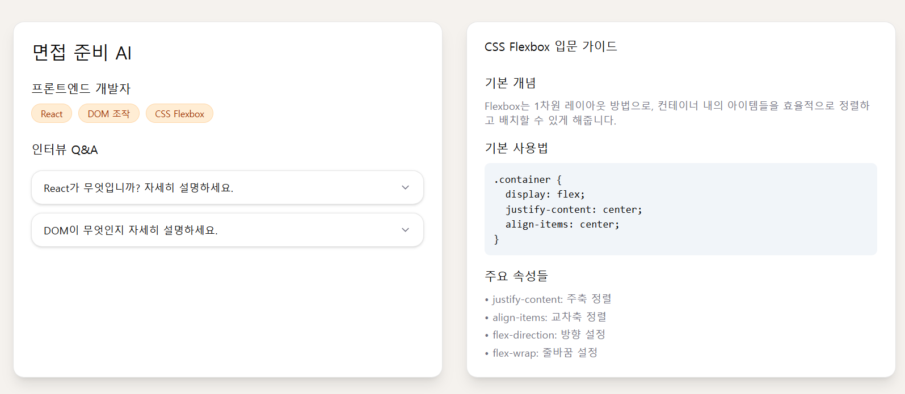

좋아! 올려준 **폴더 구조 그대로** 반영해서, 요즘 GitHub에서 많이 쓰는 “핫한” README 뼈대 만들어줬어. 바로 붙여 넣고 빈칸만 채우면 됨.

````markdown
<p align="center">
  
</p>

<h1 align="center">Interview Prep</h1>

<p align="center">
  
  
  
  
  
  
  
  
  
  
  
  
  
  
  
</p>

<p align="center">
 생성형 질문·연습·리포트까지 연결된 인터뷰 워크플로우
  <br/>
  <a href="<!-- demo url -->"><b>Live Demo</b></a> ·
  <a href="<!-- issues url -->">Issues</a>
</p>

<p align="center">
  
  
  <a href="LICENSE"></a>
</p>

---

## ✨ Features (TL;DR)
- 🔐 **Auth**: 회원가입/로그인 (JWT) — `backend/controllers/authController.js`, `routes/authRoutes.js`
- ❓ **Question Bank**: 직무/키워드 기반 질문 — `controllers/questionController.js`, `models/Question.js`
- 🗣️ **Interview Prep UI**: 질문 카드/답변 미리보기 — `frontend/ai-interview/src/pages/InterviewPrep/*`
- 👤 **Profile / Session**: 세션 생성·목록 — `controllers/sessionController.js`, `models/Session.js`
- 📤 **Upload**: 프로필 이미지 업로드 — `middlewares/uploadMiddleware.js`, `frontend/.../ProfilePhotoSelector.jsx`
- 🤖 **AI Response Preview**: 마크다운/코드 렌더 — `pages/InterviewPrep/components/AIResponsePreview.jsx`
- 🧱 **레이아웃/컴포넌트**: `layout/DashboardLayout.jsx`, `component/Cards/*`, `utils/*`

## 🗂️ Monorepo Structure
```bash
.
├─ backend/
│  ├─ config/
│  ├─ controllers/
│  │  ├─ aiController.js
│  │  ├─ authController.js
│  │  ├─ questionController.js
│  │  └─ sessionController.js
│  ├─ middlewares/
│  │  ├─ authMiddleware.js
│  │  └─ uploadMiddleware.js
│  ├─ models/
│  │  ├─ Question.js
│  │  ├─ Session.js
│  │  └─ User.js
│  ├─ routes/
│  │  ├─ authRoutes.js
│  │  ├─ questionRoutes.js
│  │  └─ sessionRoutes.js
│  ├─ uploads/
│  └─ utils/prompts.js
│
└─ frontend/
   └─ ai-interview/
      ├─ public/
      └─ src/
         ├─ assets/ (hero-img.png, heroImg.png)
         ├─ component/
         │  ├─ Cards/ (ProfileInfoCard.jsx, QuestionInfoCard.jsx, SummaryCard.jsx)
         │  ├─ inputs/ (Input.jsx, ProfilePhotoSelector.jsx)
         │  ├─ layout/ (DashboardLayout.jsx, Navbar.jsx)
         │  ├─ Loader.jsx, Drawer.jsx, Modal.jsx, DeleteAlertContent.jsx
         ├─ context/userContext.jsx
         ├─ pages/
         │  ├─ Auth/ (Login.jsx, SignUp.jsx)
         │  ├─ Home/ (CreateSessionForm.jsx, Dashboard.jsx)
         │  └─ InterviewPrep/
         │     ├─ components/ (AIResponsePreview.jsx, RoleInfoHeader.jsx)
         │     └─ InterviewPrep.jsx
         ├─ utils/ (apiPaths.js, axiosInstance.js, data.js, helper.js, uploadImage.js)
         ├─ App.jsx, main.jsx, index.css
         └─ index.html
````

## 🚀 Quickstart

```bash
# 0) 루트로 이동
cd <repo-root>

# 1) 백엔드
cd backend
npm i
cp .env.example .env   # 없으면 아래 예시 참조
npm run dev            # nodemon 기반 권장

# 2) 프론트엔드
cd ../frontend/ai-interview
npm i
cp .env.example .env   # 없으면 아래 예시 참조
npm run dev            # Vite 개발 서버
```

## 🔑 Environment

**backend/.env**

```env
PORT=4000
MONGO_URI=mongodb://localhost:27017/interview_prep
JWT_SECRET=replace_me
OPENAI_API_KEY=sk-...        # (AI 기능 사용 시)
UPLOAD_DIR=uploads
CORS_ORIGIN=http://localhost:5173
```

**frontend/ai-interview/.env**

```env
VITE_API_BASE_URL=http://localhost:4000
```

## 🧭 App Flow (Frontend)

* `LandingPage` → `Auth/Login, SignUp`
* `DashboardLayout`(Navbar 포함) → `Home/Dashboard` · `Home/CreateSessionForm`
* `InterviewPrep/InterviewPrep` → `components/AIResponsePreview`, `RoleInfoHeader`

## 🧪 NPM Scripts (예시)

**backend/package.json**

```json
{
  "scripts": {
    "dev": "nodemon server.js",
    "start": "node server.js",
    "lint": "eslint ."
  }
}
```

**frontend/ai-interview/package.json**

```json
{
  "scripts": {
    "dev": "vite",
    "build": "vite build",
    "preview": "vite preview",
    "lint": "eslint src --ext .js,.jsx"
  }
}
```

## 📡 REST API (요약)

| Method | Path                 | Desc      | File                              |
| ------ | -------------------- | --------- | --------------------------------- |
| POST   | `/api/auth/register` | 회원가입      | `routes/authRoutes.js`            |
| POST   | `/api/auth/login`    | 로그인(JWT)  | `routes/authRoutes.js`            |
| GET    | `/api/questions`     | 질문 목록/추천  | `routes/questionRoutes.js`        |
| POST   | `/api/sessions`      | 세션 생성     | `routes/sessionRoutes.js`         |
| GET    | `/api/sessions/:id`  | 세션 조회     | `routes/sessionRoutes.js`         |
| POST   | `/api/upload`        | 이미지 업로드   | `middlewares/uploadMiddleware.js` |
| POST   | `/api/ai/complete`   | AI 응답(옵션) | `controllers/aiController.js`     |

> 실제 엔드포인트가 다르면 표만 수정하세요. `apiPaths.js`에 맞춰 유지보수하면 편합니다.

## 🧱 UI Key Components

* `component/Cards/*` — 요약/질문/프로필 카드
* `component/layout/DashboardLayout.jsx` — 공통 레이아웃 + Navbar
* `pages/InterviewPrep/components/AIResponsePreview.jsx` — 마크다운/코드 블록 미리보기
* `utils/axiosInstance.js` — 토큰 인터셉터/CORS 설정
* `context/userContext.jsx` — 유저 상태/세션 공유


## 🤝 Contributing

1. 브랜치: `feature/<scope>-<desc>`
2. 커밋: Conventional Commits (`feat:`, `fix:`, `chore:` …)
3. PR 템플릿 사용 권장

## 📜 License

MIT © dmsgp2627@naver.com

```

